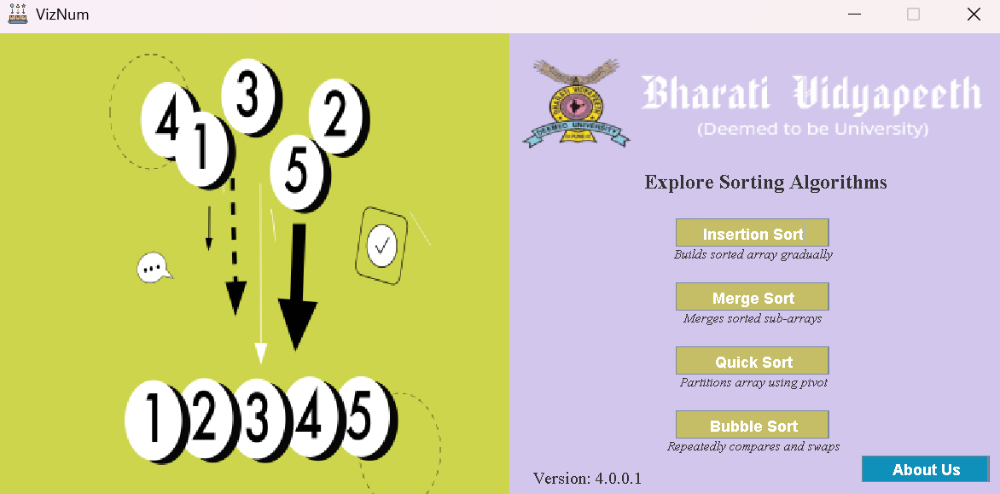
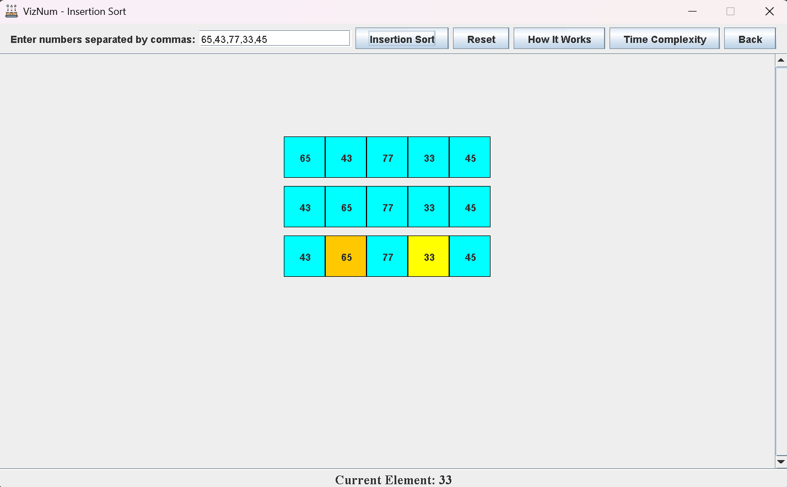
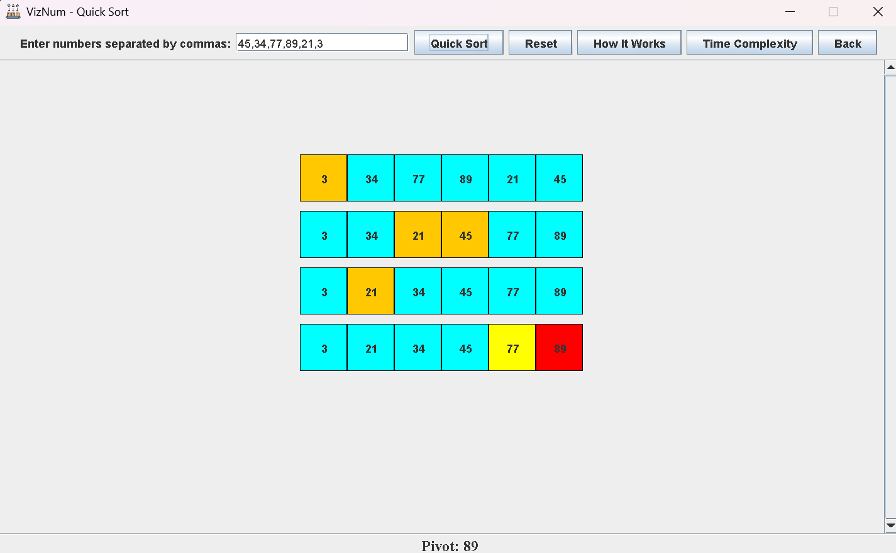
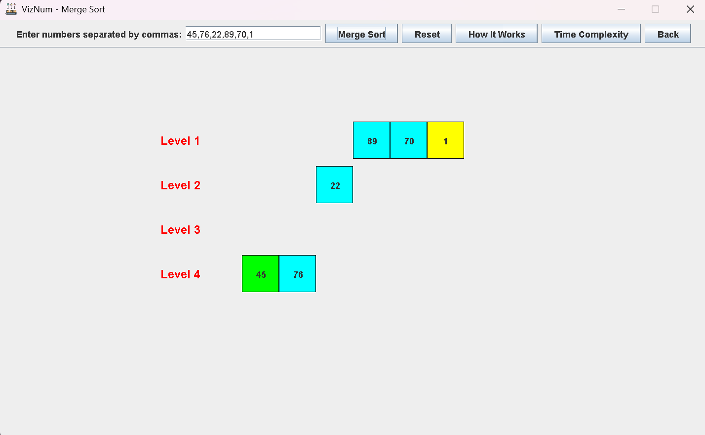
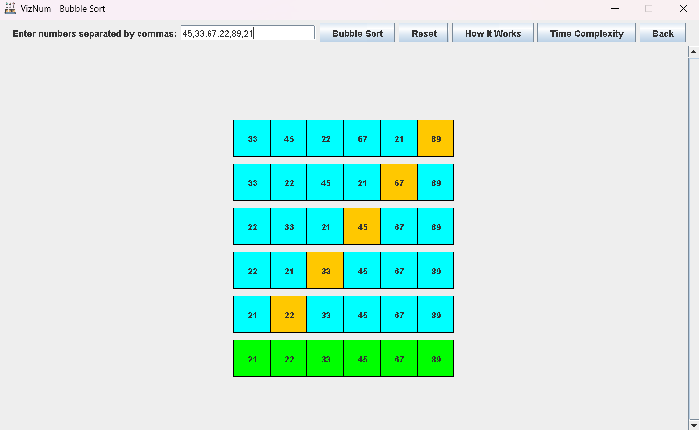
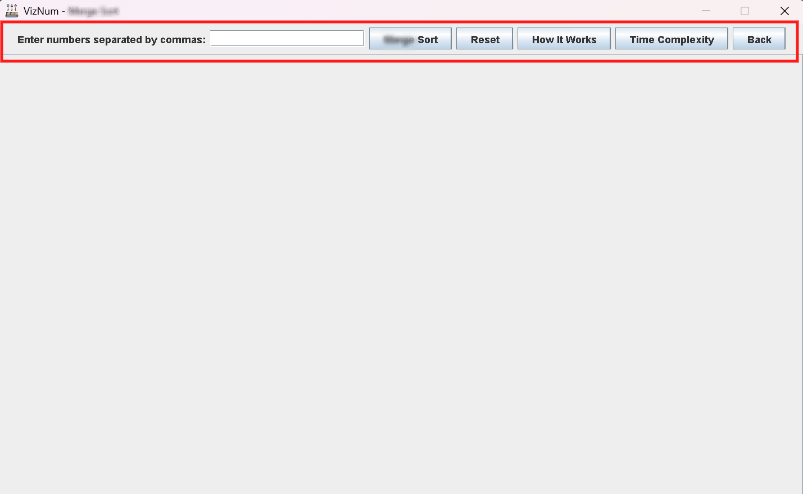

# **Sorting Algorithms Visualization 🚀**
## **Viznum - See, Sort & Learn Sorting Algorithms 👀🔢🎓s**

Welcome to the Viznum project! ✨ This interactive Java-based application offers an engaging and intuitive way to explore and understand the inner workings of various sorting algorithms. Experience sorting techniques in real-time, with step-by-step visualizations that make learning algorithms both fun and educational! �📊

## How to Run the Application ⚙️

### 1️⃣ Clone the Repository:
```bash
git clone https://github.com/Kvr-10/Sorting-Algorithms.git
```
### 2️⃣ Navigate to the Artifacts Directory:
After cloning the repository, navigate to the following path:
```
Sorting-Algorithms/out/artifacts/Sortings_jar/viznum.jar
```
### 3️⃣ Run the Application:
Locate the `viznum.jar` file in the directory.  
Double-click on `viznum.jar` to start the sorting visualization.

## 🎯 Alternative (Easier!)
You can directly download the EXE file from the [Releases page](https://github.com/Kvr-10/Sorting-Algorithms/releases/latest) and run it.  🚀

## Prerequisites (For jar file)📋
Ensure you have Java installed on your system. You can download and install the latest version of Java from the [official website](https://www.java.com/en/).

## 🌟 **Key Features**

### 📌 Sorting Algorithm Visualizations
- **Insertion Sort ➡️** Watch elements get inserted one by one!
- **Quick Sort ⚡** See the divide-and-conquer magic in action!
- **Merge Sort 🔄** Visualize merging sorted subarrays!
- **Bubble Sort 🛁** Observe elements bubbling into place!

### 🎨 Color-Coded Sorting States
- 🔴 **Current Element** (Highlighted for comparison)
- 🟢 **Sorted Elements** (Marked in green when in place)

### ⚡ Real-Time Animations
Smooth, dynamic visuals to easily follow the sorting process!

### 🖥️ User-Friendly Interface
Built with Java Swing for a clean and intuitive experience!

### 🔢 Customizable Input
Test algorithms with your own datasets!

### ⏱️ Algorithm Complexity Visualization
See how time complexity plays out in real-time!

## 📸 Application Screenshots

### 🏠 Main Interface with Algorithm Selection


---

### 🧩 Insertion Sort Visualization


---

### ⚡ Quick Sort Visualization


---

### 🔄 Merge Sort Visualization


---

### 🛁 Bubble Sort Visualization


---

### 🎛️ Interactive Controls Panel



## 🛠️ Skills Used
- **Java Programming**: Core programming language for implementing and visualizing sorting algorithms.
- **GUI Development**: Dynamic and interactive user interface using Java Swing.
- **Algorithm Optimization**: Efficiently implemented algorithms for performance.
- **Data Visualization**: Real-time visualization of sorting processes for better understanding.

## 🤝 Contributing
We welcome contributions! Feel free to:
- Open issues 🐛
- Submit pull requests 🔄

## 📩 Contact
Have questions or feedback? Raise an issue on GitHub!

## Happy Sorting! 🎉🔢✨

